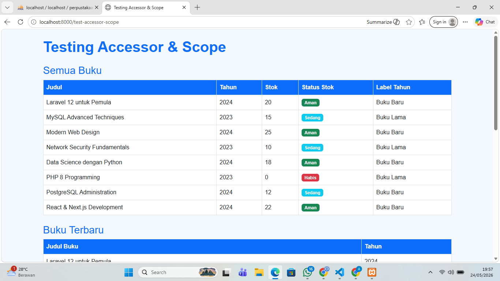

# Tugas Pertemuan 10 - Database dengan Migration dan Model

**Nama:** Ramonaa Aprilia Yuniar  
**NIM:** 60324039  
**Prodi:** Informatika  
**Semester:** 4

**Repository:** [https://github.com/ramonaapriliayuniar55/Pertemuan-10-Database-dengan-Migration-dan-Model.git]

---

## Tugas 1 - Migration Tabel Kategori

### Perintah yang dijalankan:
- `php artisan make:migration create_kategori_table` - Membuat file migration
- `php artisan make:model Kategori` - Membuat model Kategori
- `php artisan make:seeder KategoriSeeder` - Membuat seeder
- `php artisan migrate` - Menjalankan migration
- `php artisan db:seed --class=KategoriSeeder` - Mengisi data kategori

### Screenshot:

#### 1. Perintah make:migration

#### 2. Perintah make:model

#### 3. Perintah make:seeder

---

## Tugas 2 - Model Accessor & Scope

### Accessor yang dibuat:
- `getStatusStokBadgeAttribute()` - Badge warna berdasarkan stok buku
- `getTahunLabelAttribute()` - Label Buku Baru / Buku Lama
- `getStatusBadgeAttribute()` - Badge Aktif / Nonaktif anggota
- `getKategoriUsiaAttribute()` - Kategori Remaja / Dewasa / Senior

### Scope yang dibuat:
- `scopeStokMenipis()` - Filter buku dengan stok < 5
- `scopeHargaRange($min, $max)` - Filter buku berdasarkan range harga
- `scopeTerbaru()` - Filter buku tahun >= 2024
- `scopeJenisKelamin($jk)` - Filter anggota berdasarkan jenis kelamin
- `scopeTerdaftarBulanIni()` - Filter anggota terdaftar bulan ini

### Screenshot:

#### 1. Semua Buku - Status Stok & Label Tahun (`/test-accessor-scope`)

#### 2. Buku Terbaru & Buku Stok Menipis

#### 3. Semua Anggota & Terdaftar Bulan Ini
